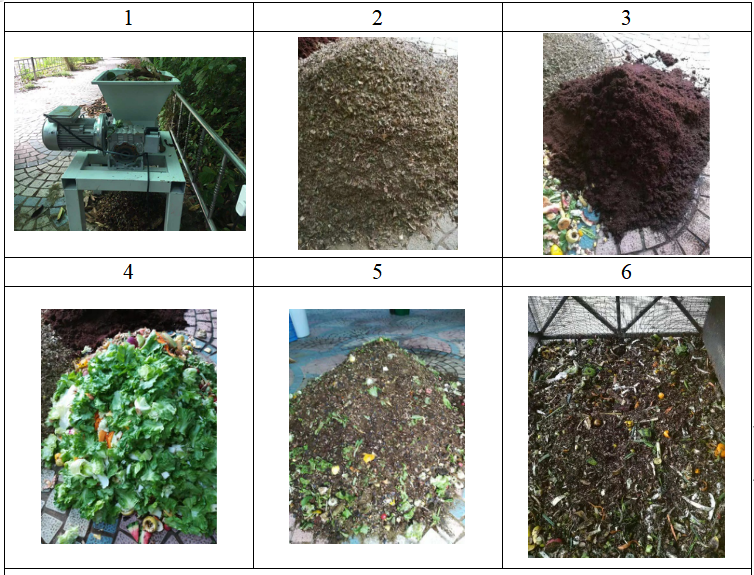
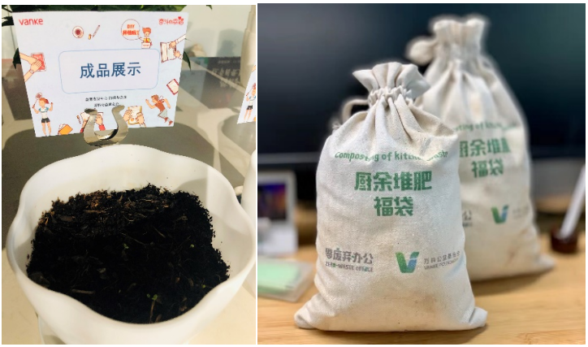

```{css, echo=FALSE}
d-title {
  text-align: center;
}
```

```{r setup, include=FALSE}
knitr::opts_chunk$set(echo = FALSE)
library(tidyverse)
library(readxl)
library(leaflet)
library(sf)
library(highcharter)
library(echarts4r)
library(lubridate)
d <- read_excel("../../all3.xlsx")
ll1 <- d %>% distinct(across(c(2, 31:32, 33:34)))

d1 <- d %>% select(4, 2, 31, 14:17) %>%
  gather(`温度类型`, `数值`, -c(1:3)) %>%
  rename(`时间` = `获取监测数据的时间`) %>%
  mutate(`时间` = ymd(`时间`)) %>%
  arrange(across(1:3)) %>%
  filter(!is.na(`数值`))
lv <- unique(d1$`温度类型`)[c(1, 4, 3, 2)]
d2 <- d %>% select(4, 2, 31, 6, 9, 12) %>%
  gather(`物质类型`, `数值`, -c(1:3)) %>%
  mutate(`物质类型` = str_replace_all(`物质类型`,
                                  "今日|添加|重量.*",
                                  "")) %>%
  rename(`时间` = `获取监测数据的时间`) %>%
  mutate(`时间` = ymd(`时间`)) %>%
  arrange(across(1:3)) %>%
  filter(!is.na(`数值`))
d3 <- d %>% 
  rename(`时间` = `获取监测数据的时间`) %>%
  mutate(`时间` = ymd(`时间`)) %>%
  rename(`厨余`=`添加厨余重量（kg)`) %>% 
  rename(`辅料`=`添加辅料重量（kg)`) %>% 
  rename(`其他物质`=`今日添加其他物质重量（kg)`)
  
  
```
# 万科公益基金会

## 关 于 机 构

### 万科公益基金会是由万科企业股份有限公司发起，经国家民政部、国务院审核批准，于2008年成立，由民政部主管的全国性非公募基金会。2017年被认定为慈善组织。截至2020年底，万科公益基金会已经在社区废弃物管理、绿色环保、救灾抗疫、古建筑保护、教育发展、精准扶贫、儿童健康等诸多领域累计公益支出6.3亿元。

### 2018年以来，万科公益基金会在新的五年战略规划框架下，以“面向未来，敢为人先”为理念，关注对未来影响深远的议题，以“可持续社区”为目标，推动实现人与社会、人与自然之间和谐共进的关系。以人为本，发扬合作奋斗的主人翁精神，万科公益基金会以“研究-试点-赋能-倡导”为工作价值链，构建公益强生态，与全国数百家公益组织展开合作，并携手企业员工、社区业主、专业人士、社会义工和志愿者，以及供应商伙伴，致力于从政策、立法、企业、国际组织和民间力量等多个维度来共同推进公益事业的发展。    

### 基金会当前着重围绕社区废弃物管理、绿色环保、社区发展和专项支持四大业务领域开展工作。  

## 走 进 堆 肥 点

**堆肥点名称**：深圳市三星万科总部园区

**堆肥类型**：开放式堆肥

**基本情况**：公司食堂的全部生厨余以及园区内产生的园林绿化废弃物堆肥。使用Ghana堆肥箱进行堆肥，每天除堆体填料操作外，无其他操作，整个堆肥过程无翻堆。共使用4个Ghana堆肥箱，平均每个堆肥箱可处理生厨余670kg与几乎等量的园林绿化废弃物。实现了生厨余与绿化废弃物的在地处理。堆肥干物质除园林废弃物外，还包括一定量的椰糠。

## 堆 肥 操 作

&emsp;&emsp;堆肥操作基本上分三步：破碎、混合、填装。生厨余简单破碎，与使用粉碎机破碎的园林绿化废弃物（含干湿），按照干湿物质重量比1：1进行混合，同时喷洒EM菌。（堆肥材料中湿物质包括生厨余以及新鲜园林绿化废弃物，干物质包括干燥的园林绿化废弃物以及泡发后椰糠。）混合好后装入堆肥箱，堆料表面不覆盖，当日操作完成。重复上述操作至堆肥箱装满。

<span style='color:green;background:背景颜色;font-size:文字大小;font-family:字体;'>**1）粉碎机**</span>

<span style='color:green;background:背景颜色;font-size:文字大小;font-family:字体;'>**2）粉碎后园林废弃物**</span>

<span style='color:green;background:背景颜色;font-size:文字大小;font-family:字体;'>**3）泡发椰砖**</span>

<span style='color:green;background:背景颜色;font-size:文字大小;font-family:字体;'>**4）生厨余**</span>

<span style='color:green;background:背景颜色;font-size:文字大小;font-family:字体;'>**5）材料混合**</span>

<span style='color:green;background:背景颜色;font-size:文字大小;font-family:字体;'>**6）混合材料放入堆肥箱**</span>
 

#### 堆肥操作步骤
 

#### 堆肥产品
## 数 据 展 示

<span style='color:green;background:背景颜色;font-size:文字大小;font-family:字体;'>**1. 万科-G1-韦和祥**</span>

**堆肥周期**：2019年7月19日-到2019年10月19日，堆肥周期为89天，共获得原始记录58条，灵析上传数据24次，记录天数约占总堆肥天数的65%。

```{r collapse=TRUE, fig.height=6}
d3 %>% filter(str_detect(`伙伴名称`, "万科公益基金会"),
                     `堆肥池` == "三星G1") %>% 
  arrange(`时间`) %>% 
  e_chart(`时间`) %>%
  e_line(`上层温度`,color='darkgreen') %>%
  e_line(`中层温度`,color='lightgreen', itemStyle=list(borderWidth=0))%>%
  e_line(`下层温度`,color='orange')%>%
  e_line(`室温`)%>%
  e_bar(`厨余`,y_index = 1)%>%e_bar(`辅料`,y_index = 1)%>%e_bar(`其他物质`,y_index = 1) %>%e_y_axis(scale=TRUE) %>%  e_datazoom(type = 'slider') %>% 
  e_aria(enabled =  TRUE,decal = TRUE)%>%  e_tooltip( trigger = 'axis') %>% 
  e_animation(
  show = TRUE,
  duration = 10000
) 
```


**添加厨余重量：**厨余：超过967.6kg；干物质：超过1335kg；厨余垃圾：干物质质量比约为0.72：1；本轮堆肥加入大量的绿化垃圾，堆肥前期绿化垃圾没有分类，作为厨余垃圾的一部分计算添加，2019年8月24日起将绿化垃圾分为干绿化垃圾和湿绿化垃圾，干绿化垃圾作为干物质，湿绿化垃圾作为厨余的一部分，按照干湿物质重量比1：1添加。

<span style='color:green;background:背景颜色;font-size:文字大小;font-family:字体;'>**2. 万科+三星+G2**</span>

**堆肥周期**：2019年8月29日至2019年11月20日，本轮堆肥周期为84天，共获得原始记录60条，灵析上传数据11次，记录天数约占总堆肥天数的70%。

```{r collapse=TRUE, fig.height=6}
d3 %>% filter(str_detect(`伙伴名称`, "万科公益基金会"),
                     `堆肥池` == "三星G2") %>% 
  arrange(`时间`) %>% 
  e_chart(`时间`) %>%
  e_line(`上层温度`,color='darkgreen') %>%
  e_line(`中层温度`,color='lightgreen', itemStyle=list(borderWidth=0))%>%
  e_line(`下层温度`,color='orange')%>%
  e_line(`室温`)%>%
  e_bar(`厨余`,y_index = 1)%>%e_bar(`辅料`,y_index = 1)%>%e_bar(`其他物质`,y_index = 1) %>%e_y_axis(scale=TRUE) %>%  e_datazoom(type = 'slider') %>% 
  e_aria(enabled =  TRUE,decal = TRUE)%>%  e_tooltip( trigger = 'axis') %>% 
  e_animation(
  show = TRUE,
  duration = 10000
) 
```

**添加物质重量：**厨余+绿化（干绿化+湿绿化）：813kg；干物质（椰渣）772 kg；厨余垃圾：干物质质量比为1.05：1。

**堆肥过程变化：**堆肥第7天，中层温度超过55℃。

## 堆 肥 实 践 总 结

<span style='color:green ;background:背景颜色;font-size:文字大小;font-family:字体;'>**1. 分层堆法导致堆体干湿不均**</span>

&emsp;&emsp;堆肥初期采用三明治堆肥的方法，一层厨余一层园林绿化废弃物，使用椰糠量较少，堆体湿度较大，有渗滤液。后翻出混匀，并改用混匀后再加进堆肥箱的方法后湿度好转，无渗滤液出现。

<span style='color:green ;background:背景颜色;font-size:文字大小;font-family:字体;'>**2. 不定期出现黑水虻**</span>

&emsp;&emsp;不定期出现黑水虻，且数量较多，可能和湿度太大且湿度不均匀有关。每日填料混合装入堆肥箱后未作表层覆盖，也可能是导致黑水虻大量繁殖的原因。黑水虻幼虫一般喜欢生长在堆体内部，只有在翻肥时，才可能看到黑水虻幼虫。而且暴露的黑水虻幼虫，会迅速钻向堆体下部（根据堆肥观察）。有研究表明，30-38°适合黑水虻幼虫生长，当超过45°时黑水虻幼虫死亡率达到50%以上，且生长缓慢。堆体表面上的幼虫无法通过堆体中部高温区进入堆体下部，所以会出现在肉眼可见的堆体表层。另外，黑水虻是一种食腐昆虫，有研究证明黑水虻成虫的寿命为3-4天，并不喜欢出现在人类活动区域。而且黑水虻幼虫对蝇蛆幼虫的出现有一定的抑制作用。

<span style='color:green ;background:背景颜色;font-size:文字大小;font-family:字体;'>**3. 堆肥箱外混合堆法可以减少堆肥过程中渗滤液的产出，并且无臭。干湿物质比例控制得当，堆肥过程中不需进行翻堆。**</span>


